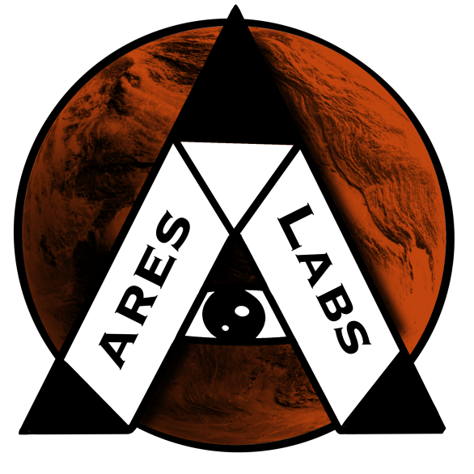

# Documentation repo of group-06
   This document will explain how to deploy our proof of concept on your device. 
## Prerequisites
1. Make sure you've got `node` installed
2. Make sure you've got `npm` installed
3. Make sure you've got `java` installed

## Instalation

1. Clone the server:
    - SSH: git@git.ti.howest.be:TI/2022-2023/s3/analysis-and-development-project/projects/group-06/server.git
    - HTTPS: https://git.ti.howest.be/TI/2022-2023/s3/analysis-and-development-project/projects/group-06/server.git

2. Clone the client:
    - SSH:git@git.ti.howest.be:TI/2022-2023/s3/analysis-and-development-project/projects/group-06/client.git
    - HTTPS: https://git.ti.howest.be/TI/2022-2023/s3/analysis-and-development-project/projects/group-06/client.git

## User guide
1. Run the server via your favourite IDE or via the CLI.
2. Run `npm run dev` command in your client terminal.

## Important public urls  
> * [Business Case Link](https://docs.google.com/document/d/1ObQ3rBI7G-NltQehbjTW6Hwc3osGvSEEYOYz42bJ8wg/edit?usp=sharing)
> * [Wireframes Administrator User](https://app.moqups.com/Kuc2fZQRVcKK5xP5TpTNb9zflt79wlyj/view/page/aeca3c263)
> * [Wireframes Basic User](https://app.moqups.com/jAVXvEnBpjb1M8tUcq6Toozh1w6VihV0/view/page/ad64222d5)
> * [Wireframes Adminstrator](https://app.moqups.com/9jsg9C5akCLrhODJ8aVPPvIY8un9fuPO/view/page/ad64222d5?ui=0&fit_width=1)

## Badges

### Client

### Server

